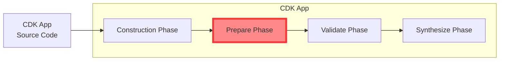

# cdk-mentor

This library acts as a mentor to AWS CDK users, providing guidance and suggestions for better infrastructure coding practices. Inspired by [cfn_nag](https://github.com/stelligent/cfn_nag).


## Overview Image

This library uses Aspects and is executed during the prepare phase.



## Introduction

```
import * as cdk from 'aws-cdk-lib';

const app = new cdk.App();
stack = new Stack(app);
cdk.Aspects.of(app).add(new CdkMentor());

new sns.Topic(stack, 'testStack');
```

```
% npx cdk synth
```

## Available Rules

- Recommends PascalCase for Construct IDs
- Avoid `Stack` or `Construct` in Construct IDs
- Detecte strong cross-stack references
