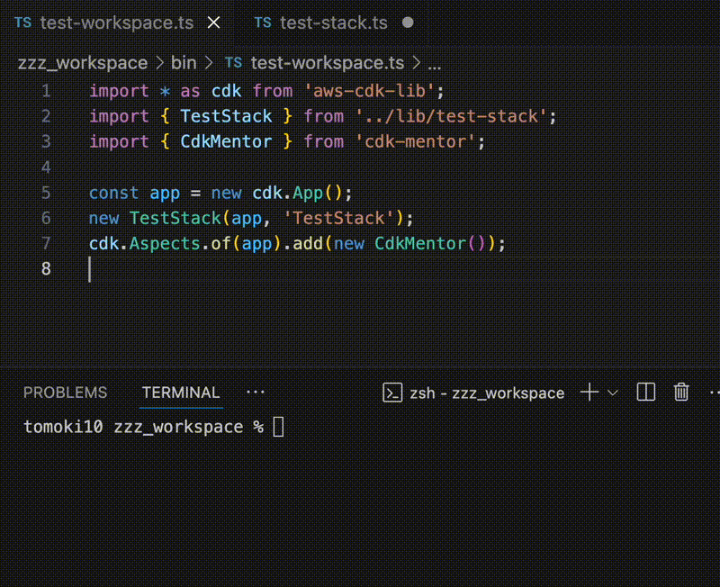
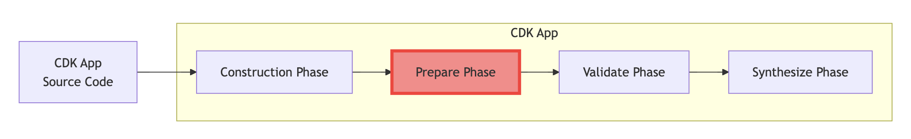

# cdk-mentor

This library acts as a mentor to AWS CDK users, providing guidance and suggestions for better infrastructure coding practices. Inspired by [cfn_nag](https://github.com/stelligent/cfn_nag).


[](https://constructs.dev/packages/cdk-mentor)

## Overview Image



This library uses Aspects and is executed during the prepare phase.



## Introduction

```bash
% npm install -D cdk-mentor
```

```ts
import * as cdk from 'aws-cdk-lib';
import * as sns from 'aws-cdk-lib/aws-sns';
import { TestStack } from '../lib/test-stack';
import { CdkMentor } from 'cdk-mentor';

const app = new cdk.App();
const stack = new TestStack(app, 'TestStack');
cdk.Aspects.of(app).add(new CdkMentor());
```

```ts
import * as cdk from 'aws-cdk-lib';
import { Construct } from 'constructs';
import * as sns from 'aws-cdk-lib/aws-sns';

export class TestStack extends cdk.Stack {
  constructor(scope: Construct, id: string, props?: cdk.StackProps) {
    super(scope, id, props);
    new sns.Topic(this, 'testTopic'); // Construct ID is NOT PascalCase
  }
}
```

```bash
% npx cdk synth -q
[Error at /TestStack/testTopic/Resource] [ERR:001]: Construct ID "testTopic"should be defined in PascalCase.
Found errors
```

## Available Rules

- Recommends PascalCase for Construct IDs
- Avoid `Stack` or `Construct` in Construct IDs
- Detecte strong cross-stack references
